# Ignacio Giadach - T2A2
## Two-sided marketplace - Music app

## The Idea / Problem explanation / Solving

myhar.money is built for the spiring musician and the music lover, using a model that differs from traditional economics and relies on good will. "The art of giving and receiving". A user can upload his music for free and set a donation target. Users can listen to the music for free and, if they want, donate to the user in 1 dollar increments.

The idea is to encourage good will and give back to the artist, giving a platform to aspiring musicians and also to mainstream artists to showcase their latest work or even upload a song to start a fundraiser.

Currently most musicians have basically these options:

- Upload their music to services such as Spotify and get a commission for every play.
- Start a YouTube channel and get paid as a creator
- Start a Patreon page where users sign up for a monthly payment to encourage the artist to keep creating.

myharmoney is filling up a spot in the market where:

1. Users might not be wanting to ask for a recurrent charge

2. Users just want to get something out of their music without having to deal with complex sign-up and setting-up (i.e. when uploading music to Spotify), where commissions are also extremely low for low play volumes.

3. Users don't want to go through the hassle of having to create a visual channel when all they want to do is showcase their music.

## Links

myhar.money is currently deployed in Heroku:
https://myhar-money.herokuapp.com/

Also running on this URL:

http://myhar.money

The project is available on GitHub, under the project's code-name wavecloud:

https://github.com/igscl/wavecloud

## Description of the project

- Purpose: 

Encourage good will and provide a platform that allows to showcase a musician's work in a simple way and allows you to listen to music easily. It also showcases and encourages donations by showing you how much you've given and received. There are no complex Digital Rights Management (DRM) systems to control access to any of the material. The music is available for free from the beginning.

- Features

    * Login page
    * User creation
    * Profile creation
    * User can create tracks by uploading audio files
    * Audio file playing
    * Original audio file download
    * Audio control bar for web and mobile
    * User can like tracks
    * User can see liked tracks
    * User can donate to track uploads via Stripe
    * User can see money donated and received
    * Audio feed is sorted by creation date
    * Progress bar for donations in tracks

- Functionalities:

    * Login page with user creation form, ability to remember the session
    * When user creates a new account, is taken directly to the feed which shows the global available tracks
    * "My Tracks" shows the user tracks, also showing the donation progress bar 
    * "My Tracks" and "Check my Stats" section require Profile creation, user is redirected to profile creation page if it hasn't been created yet
    * Background animations on track and listing pages
    * When track is added to favorites page reloads and animation reloads
    * Audio playing shows visual representation of the wave file, can control on mobile and desktop
    * Audio controls are on the navigation bar only when user needs it for a better experience
    * "Check my Stats" page and money on navigation bar show give/receive stats for users and favorites

- Sitemap

    * 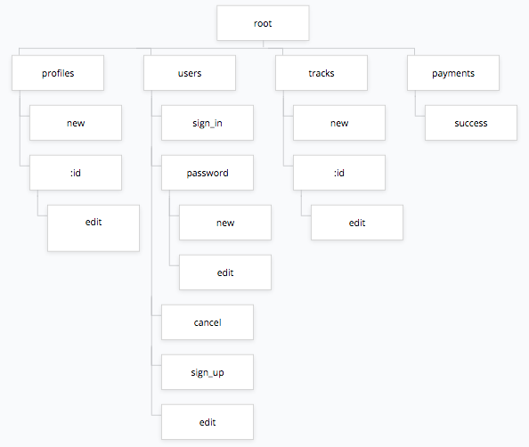

- Screenshots
    * Log in screen
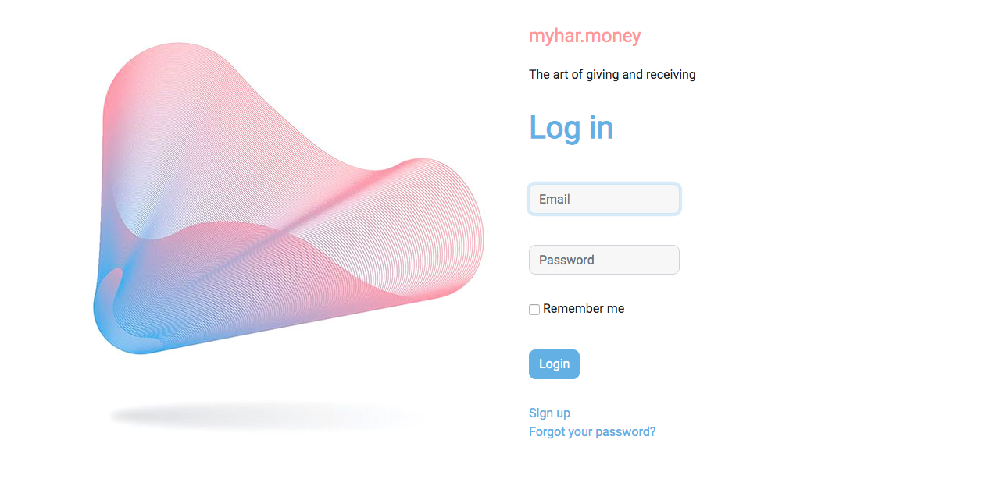
    * Feed Screen
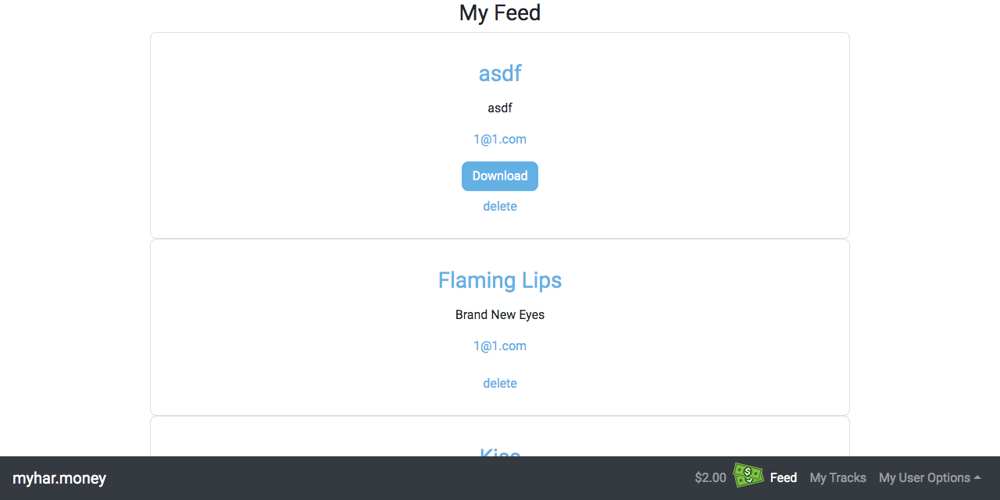
    * Track View
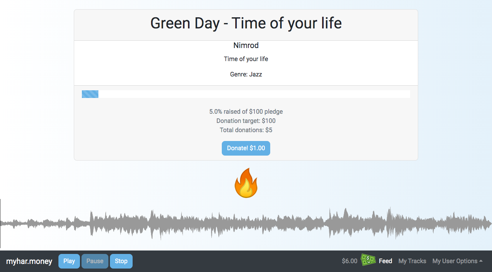
    * My Tracks
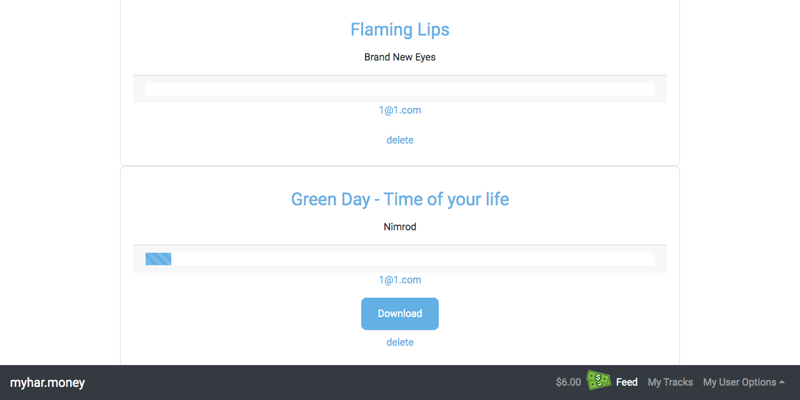
    * Check My Stats
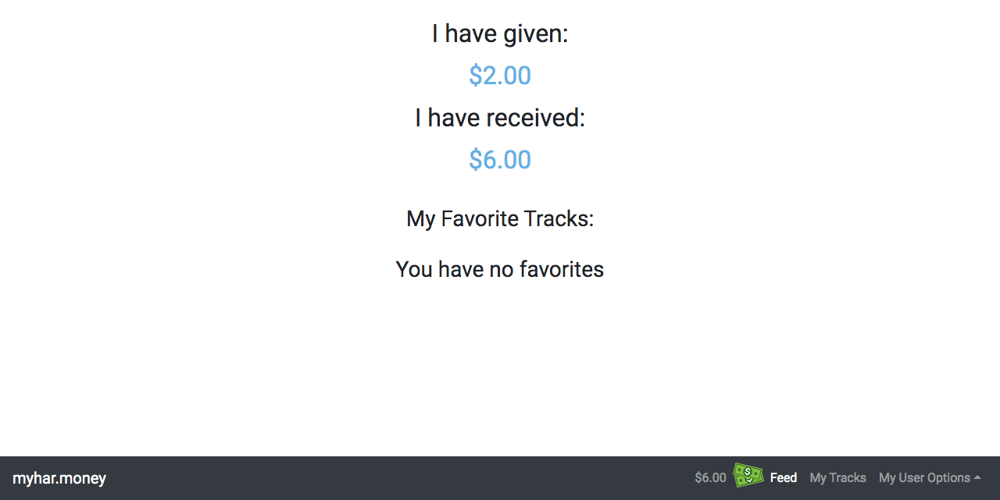
    * Create Track
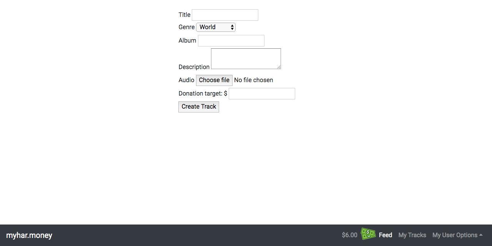

- Target audience: Musicians, aspiring musicians and music lovers of any age, gender or nationality. For money collection user needs to be located in one of the launch location countries.

- Tech stack used for this version:

    * Ruby 2.6.3p62
    * Rails 5.2.4.1
    * PostgreSQL
    * HTML
    * CSS
    * SASS
    * jQuery
    * Bootstrap 4.4.1
    * Heroku
    * Amazon S3
    * Cloudflare DNS
    * wavesurfer.js
    * Trello
    * Slack
    * Ultrahook
    * Devise
    * Balsamiq
    * Git

## User stories (Who and Why / For what / From where)

Music lover, musician or aspiring musician can sign up for the service to listen, donate or upload music from the login page.

User who has signed up can login to the service to listen, donate or upload music from the login page

When the users sign in, they can navigate through the feed to download, delete or go into the track view for further options

Signed in users can see the amount of money they have received in the status bar for all the tracks they have uploaded, they can also go into the "My tracks" section, "Create Track", "Check my Stats" or simply log out of the service.

Signed in users in the "My Tracks" section can view the tracks they have uploaded, are able to delete the tracks and also see the donation status for each track in the progress bar. They can also click on each one of the track-names to go to the track view page.

Signed in users in the track view page can see the track title, description, genre, donation progress bar, percentage of donations raised, donation target and total donations.

Signed in users in the track view page can donate to the owner of the uploaded track in increments of 1 dollar by clicking on the "Donate!" button.

Signed in users in the track view page can favorite a track to add the track to their favorite tracks by clicking on the flame image. When a track is favorited the flame gets color.

Signed in users in the track view page can listen to the uploaded track by using the navigation bar buttons "Play", "Pause" and "Stop". They can also scroll to the desired location in the visual waveform.

Signed in users in the "Check My Stats" page can see how much money they have donated to other users and how much money they have received for their track uploads.

Signed in users in the "Check My Stats" page can see all of their favorite tracks and can click through into each individual track. They also have download and delete buttons. The last one is only available if the logged in user uploaded the track.

Signed in users on the Feed page can click on other users "username", which in this case is their email address, which will show them all of the user's uploads and donation progress for each of their uploaded tracks.

Signed in users can upload a new track by going into the My User Options >> Create Track on the navigation bar.

Signed in users in the Create Track page can add title, genre, album title, description, choose audio file and set donation target. Then can press the Create Track button to upload the new track. This will take the user back into the feed.

Signed in users in any of the pages can log-out of the service by going into My User Options >> Log-out

## Wireframes

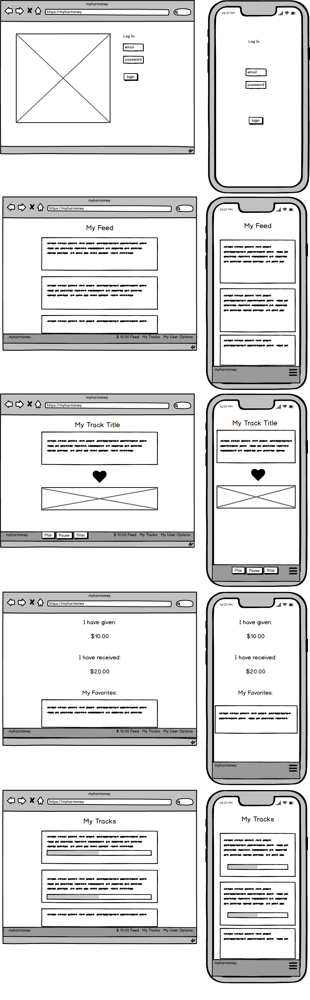

## ERD

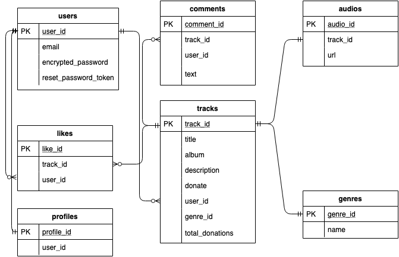

## High-level components:

This app follows an Model-View-Controller pattern, relying on the wavesurfer.js javascript library for the audio playing capabilities.
The front-end is being styled using Bootstrap component library. The project also utilizes jQuery. Bootstrap and jQuery are being used as a gem. Faker gem is being used to generate fake data.

When the user signs up or logs in Devise gem handles the user data. Once in all the audio files are linked to a bucket on Amazon S3.

This app is using Stripe to manage all the payment system. Once a payment goes through and is successful some data is added to the tables to track donations, who donated and how much they've donated.

## Third party services

The app relies on Stripe API for payments, it accepts form-encoded request bodies and returns JSON-encoded responses which facilitated the integration to the app. This was the application of choice due to its robustness in terms of business integration, payment management and availability for several countries. This was an important point as after launch dates donations should be able to be distributed to several other countries. Building this app with Stripe integration from the ground up helps facilitate future developments.

Devise gem is being use for authentication purposes. This is a good idea since we don't want to be building authentication from the ground up. Devise is a reliable way to handle user creation and provides a complete MVC solution based for the Rails engine.

Amazon S3 was used for the audio file blob storage which integrated seamlessly with the wavesurfer.js library. This was the storage of choice for its reliability, security, cost, availability and prestige as an industry standard. Bucket configurations allowed an easy set-up and eventual debugging while building the app. Amazon S3 has over 99.999999999% durability by design, meaning there is a very low possibility of the files being down at a certain point in time.

The app is hosted using the Heroku cloud application platform which allowed fast integration and set-up of all the services used. This was the platform of choice due to its scalability, security and ease-of-use. Using other platforms would have required some sort of installation or set-up. Heroku also allowed the early development to be hosted for free, which allowed for testing, and eventually, made it easy to stay with them due to the easy transition. Heroku provides "dyno" hours. Then the dyno is not actively being accessed it shuts down, provides 512 MB RAM per dyno and a dashboard for easy management. It also allowed the integration with custom domains.

## Model Relationships:

Audio model belongs to Track model - This is currently not being used as the audio file is being loaded directly from ActiveStorage (active_storage_attachments table)
    belongs_to :track

Comment model belongs to Track and User models. - This is also not implemented in the views as of yet, as this wasn't a feature that I wanted to include at this stage. The database is capable of it.

    belongs_to :track

    belongs_to :user

FavoriteTrack mode belongs to Track and User model, this is done to establish a relation in a join table for the user favorites.
    belongs_to :track

    belongs_to :user

Genre model has many tracks, meaning certain genres can contain many tracks, for example a Foo Fighters album will contain Rock songs.

    has_many :tracks

Profile class has many tracks, belongs to a user and validates uniqueness of user_id, meaning a user cannot have more than one profile.

    has_many :tracks

    belongs_to :user

    validates_uniqueness_of :user_id, message: "you already have a profile"`

TrackDonation model belongs to a track and a user. This is a join table which relates who made the donation and to which track. This works just as the favorites model, but in practicality is a bit more complex as this join table contains a column to specify the donation amount.

    belongs_to :track
    belongs_to :user

Track model validates the presence of title, genre_id, album, description and donation amount fields for the creation of a track - it validates that those fields are present when submitting the form.

    validates_presence_of :title, :genre_id, :album, :description, :donate
    belongs_to :user
    belongs_to :genre
    has_one :audio
    has_many :comments
    has_one_attached :audio

    has_many :favorite_tracks
    has_many :favorited_by, through: :favorite_tracks, source: :user
    has_many :track_donations
    has_many :donated_by, through: :track_donations, source: :user
  

Track model belongs to a user, a genre, has one audio file, has one attached audio and has many: comments, favorite_tracks, track_donations, favorited_by (through favorite_tracks, with users being the source) and donated_by (through track_donations, with users being the source). The last two relationships are to establish the relationships for the join tables and being able to call those in Rails console. For example, because of this set-up I can call Track.find(1).favorited_by, which would show me all the users that have favorited the track with the id: 1. The same is valid for Track.find(1).donated_by. This would show me all the users who have donated to track id: 1

User model has devise gem relationships: database_authenticatable, registerable, recoverable, rememberable and validatable. This is for user registration and validation, also has one profile, many tracks, comments, favorite_tracks, track_donations and for the join tables: favorites (through favorite_tracks, with track being the source) and many donations (through track_donations with track being the source). This is another join table that behaves like the ones in track model. As an example we can call User.find(1).favorites which would look for the favorites in the tracks model and also User.find(1).donations, which would find the donations made to the user but looking for the tracks of said user and checking donations made to those tracks.

    devise :database_authenticatable, :registerable,
            :recoverable, :rememberable, :validatable
    has_many :tracks
    has_many :comments
    has_one :profile
    has_many :favorite_tracks
    has_many :favorites, through: :favorite_tracks, source: :track
    has_many :track_donations
    has_many :donations, through: :track_donations, source: :track

## Database relations:

Tracks is the main table surrounding this project, it contains: title, album, description, donate (the donation request amount), user_id, genre_id and total_donations foreign keys. This allow for the tracks to have relations with certain users, genres and donations made by other users and facilitates complex scenarios by not increasing the size of the track table itself, but by connecting tables.

Profiles table connects to the user_id using a foreign key.
Comments table connect to the user_id and track_id using a foreign key.
Audios connect to the track_id using a foreign key.
Track donations join table connects to track_id and user_id. It does not show in the ERD generated by DBeaver, as it is a join table.
Favorite_tracks table also connects to track_id and user_id using foreign keys and is a join table that behaves the same way as the favorites table.

Because of Rails internals, active_storage_attachments connects to active_storage_blogs for attachments using S3 with the blob_id.

##  Database schema design

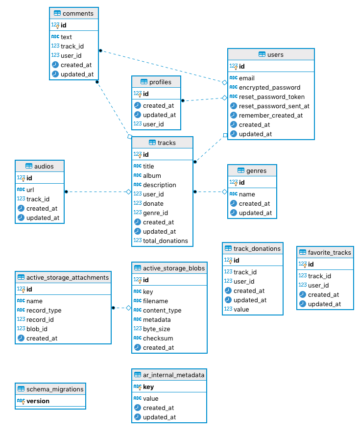

## Task allocation

Task allocation was done using Trello.
Images show progress from older to most recent screenshot:

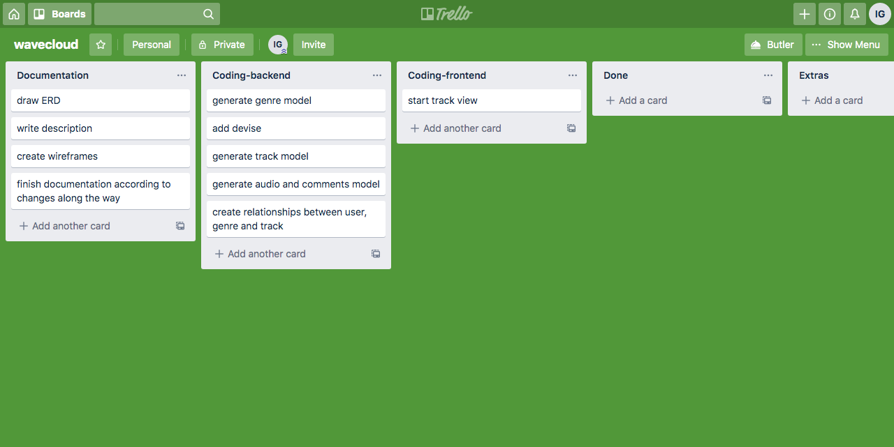
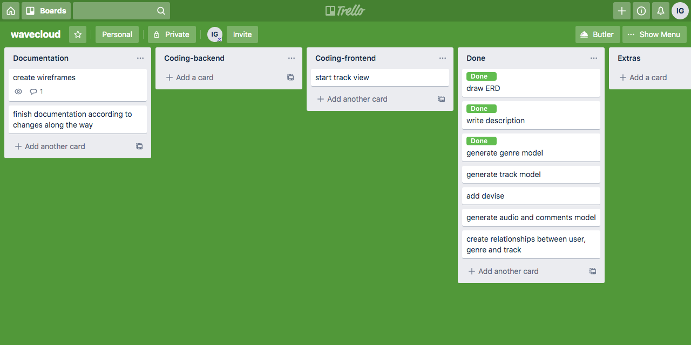
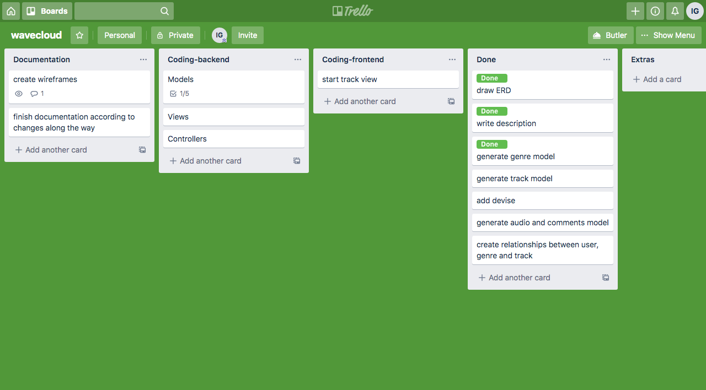
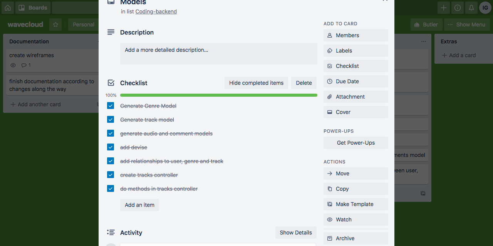
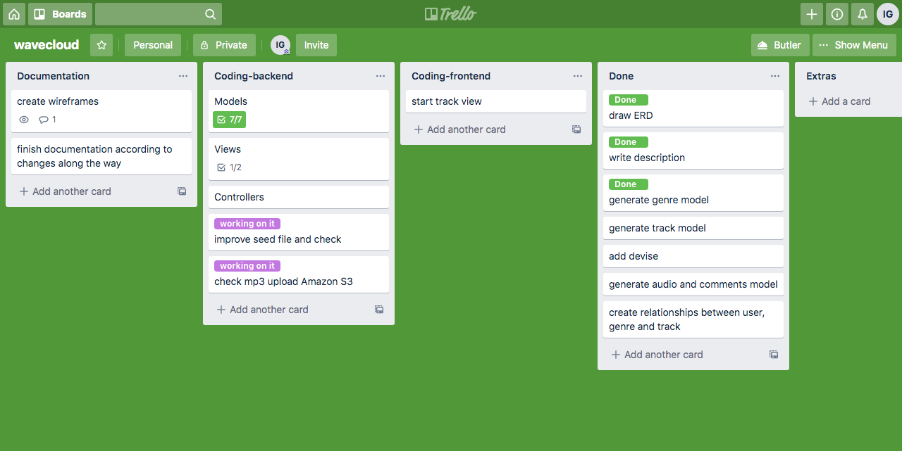
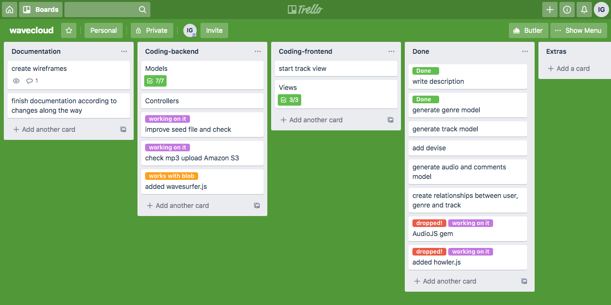
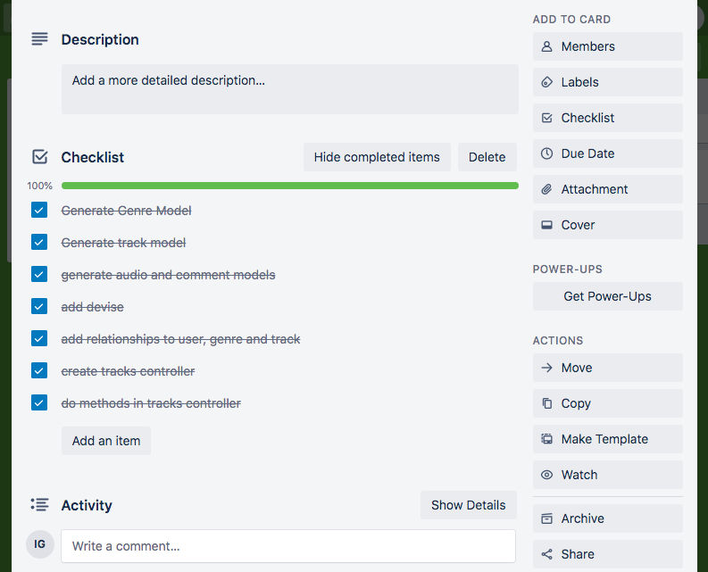
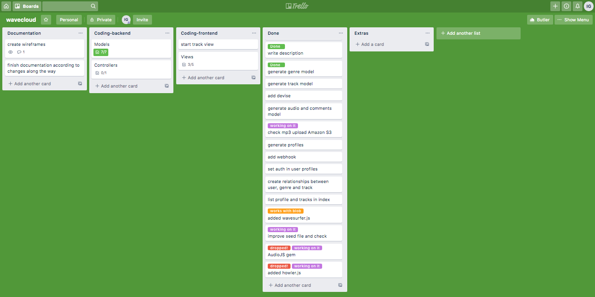
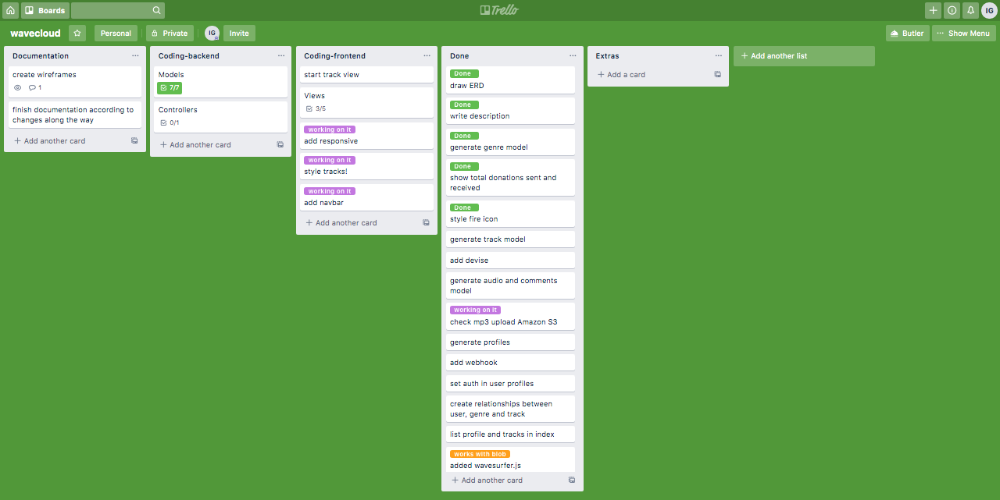

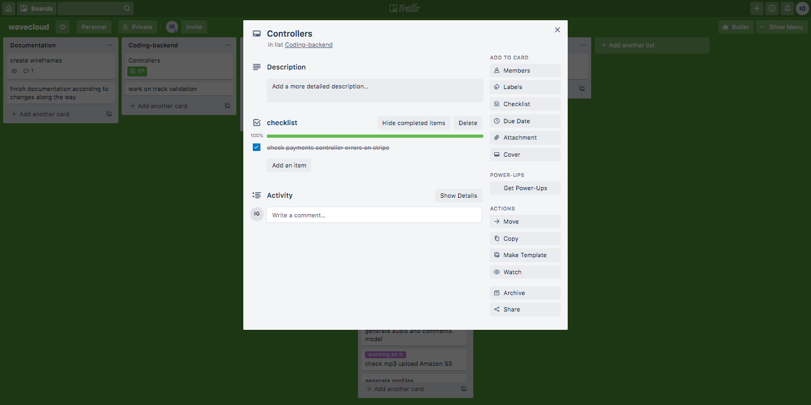
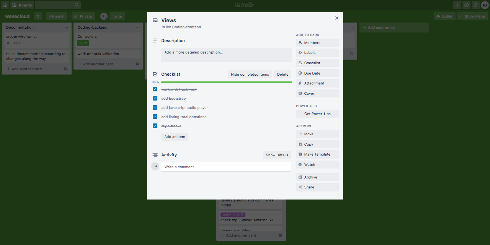
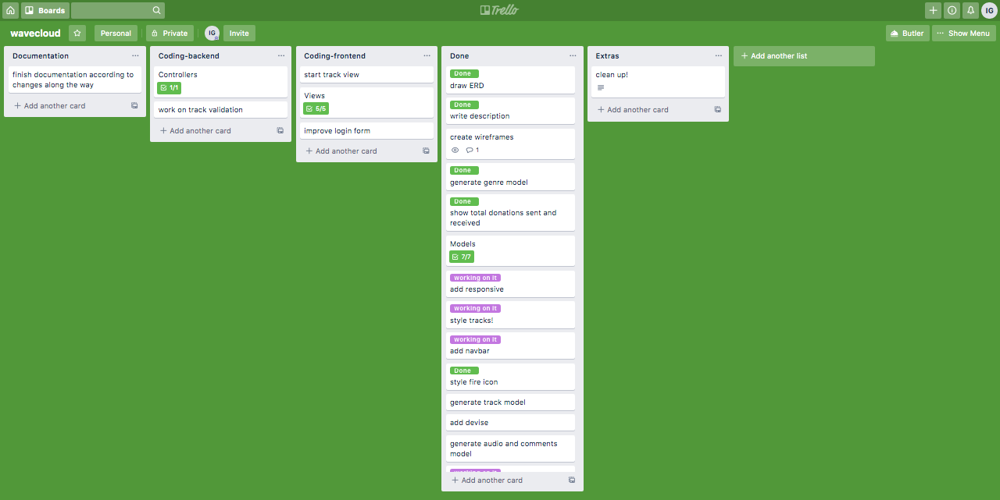

## Further Developments
Port this to NodeJS.